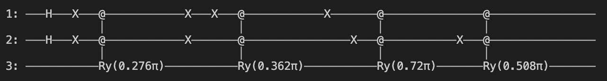
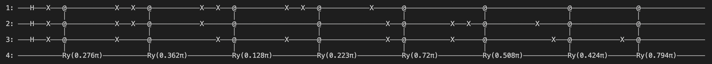
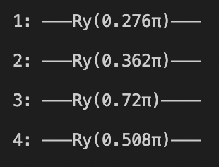
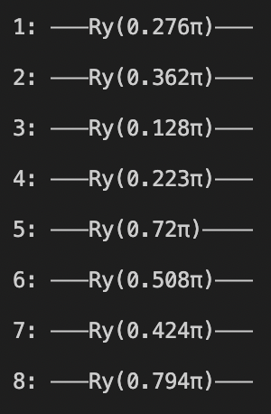
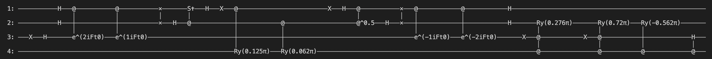
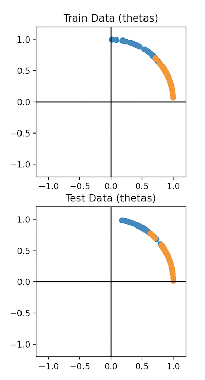
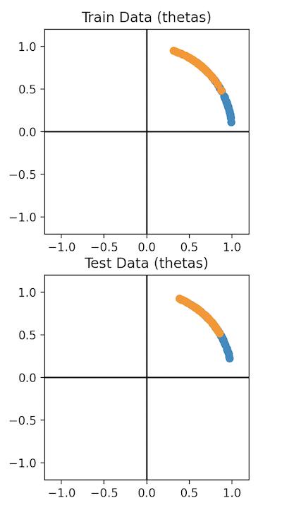

# Quantum-SVM

This repository contains the files to implemenet a Quantum Support Vector Machine utilizing the [Python Cirq library](https://quantumai.google/cirq), from Google Qauntum AI.
The repository is divided into 5 files, which handle different aspects of the QSVM mechanism. The files and their specific purposes are detailed below. 
This repo provides two examples of the use of the QSVM, one utilizing the [Keras MNIST](https://keras.io/api/datasets/mnist/) dataset and the other utilizing the [Keras Boston Housing](https://keras.io/api/datasets/boston_housing/) dataset. 
There is also an implementation of the classical SVM (specifically SVC) from Scikit-Learn which is used for comparison on the given datasets.
This implementation of the QSVM is purely for binary classification. Multiclass classification could be accomplished by modifying the execution for one-vs-all classification, but that has not been setup at this time.
The circuits for the QSVM and for the Quantum Kernels come from the following paper: [Support Vector Machines on Noisy Intermediate-Scale Quantum Computers](http://www.diva-portal.org/smash/get/diva2:1381355/FULLTEXT01.pdf)

# Files

**- gates.py**: This file contains all of the additional gates necessary for the QSVM that were not already included in the Cirq library. Each gate is extended from the Cirq Gate object.

**- data_preprocess.py**: This file contains all of the methods for loading and preprocessing the two datasets, MNIST and Boston Housing. This file will load the data, split it into X and Y / training and test sets, then preprocess the X values so that they are converted to single theta values per datapoint for the QSVM algorithm or 2-pair x0,x1 normalized datapoints for the SVM algorithm. The methods within are utilized by the other files. Running the file itself will plot the train and test thetas generated for the selected dataset.

**- quantum_kernel.py**: This file contains two quantum circuits for calculating the kernel matrix for use by the QSVM circuit. The first implementation makes use of more gates, but fewer qubits than the second making it potentially less practical on a real system. However, the resulting kernel matrix from the first implementation is far better than that of the second, and therefore the second is not utilized in any of the other files. The methods within are utilized by the other files. Running the file itself will calculate the two different kernels on the selected dataset and print them.

**- qsvm.py**: This file contains the circuit for the Quantum Support Vector Machine and the code to run the QSVM on the two datasets to calculate a test accuracy score.

**- svm.py**: This file contains the classical implementation of the Support Vector Classifier from the [scikit-learn library](https://scikit-learn.org/stable/modules/generated/sklearn.svm.SVC.html). It also runs the SVC on the two datasets to calculate a test accuracy score. 

To run any of the files, minus the gates.py file which solely contains helper classes, you can simply run the file normally (`python X.py`) which will run the file on the MNIST dataset. If you wish to run on the Boston Housing dataset you can simply add the following flag to the command: `-d housing`. The `-d` flag allows you to select the datasets with the following two options: [mnist, housing].

# Circuits

As mentioned in the files section, there are three circuits that are available in this repo related to the QSVM algorithm. There are two variants of the quantum kernel circuit, and the QSVM circuit which makes use of one of the kernels. 

The kernel circuits are designed so that they can make use of a variable number of training datapoints. For ease of use it is recommended that the number of training points used is a power of 2. Additionally, it is not recommended to feed more than 8 datapoints to the `build_kernel_simplified` method. The simplified kernel circuit creates a qubit line for each datapoint, which means that the final state vector is the tensor product of N qubits, resulting in 2N terms in the final state vector. The outer product of this state vector is then taken with itself, resulting in a matrix that is 2Nx2N. As this grows exponentially with N, it is recommended to keep N small. In contrast, the `build_kernel_original` method results in a matrix that is log2(N)xlog2(N), thus more training data may be fed to the original kernel method. Examples of each circuit are shown below:

The first two images show the original quantum kernel creation circuit for 4 and 8 training thetas, respectively. The second two images show the modified quantum kernel creation circuit for 4 and 8 trainin thetas, respectively.

The other circuit is the QSVM circuit, which is based on the HHL circuit. The initial portion of the QSVM circuit is the HHL circuit, which is composed of three parts: phase estimation, controlled rotation, and inverse phase estimation. After the HHL algorithm is the training oracle, which appears very similar to the original quantum kernel creation circuit in the case when there are only two training thetas. The last portion, the final two gates, is the test oracle, which takes a single test theta in the controlled rotation and then applies a Hadamard gate to the 3rd (Y) line. The only additional part of the circuit is the first two gates (X, H) on the 3rd line, which causes the qubit to enter the HHL circuit in the state (1/$\sqrt{2}$) * (|0⟩ - |1⟩). The full circuit for the QSVM can be seen below:

# Experiments

Two experiments are run using the QSVM and the classical SVM. The QSVM algorithm is simulated on a classical computer and has not been tested on an actual quantum computer. The two datasets are from the Keras datasets API. The first experiment is run on the MNIST dataset, with the numbers 6 and 9 representing the +1 and -1 classes, respectively. The second experiment is run on the Boston Housing dataset, with all datapoints with target prices less than 21 and target prices greater than or equal to 21 representing the +1 and -1 classes, respectively. Both datasets have their respective load and preprocess methods in the `data_preprocess.py` file. The resulting thetas can be seen for the train and test sets of each dataset in the plots below:

The MNIST training and test thetas are on the left plot, while the Boston Housing training and test thetas are on the right. As can be seen, the data is not perfectly linearly separable in any case. Meaning that there is guaranteed to be some inaccuracy in the models, since both the QSVM and the classical SVM are utilizing linear kernels. Both the quantum and classical SVMs were trained on 128 training datapoints for each dataset, and were tested on 100 MNIST test points and 92 Boston Housing test points (due to the Boston Housing dataset being much smaller). The results from the experiments can be seen in the table below.

<table class="tg">
<thead>
  <tr>
    <th class="tg-0pky"></th>
    <th class="tg-c3ow">MNIST</th>
    <th class="tg-c3ow">Boston Housing</th>
  </tr>
</thead>
<tbody>
  <tr>
    <td class="tg-dvpl">QSVM Accuracy</td>
    <td class="tg-c3ow">91%</td>
    <td class="tg-c3ow">71.74%</td>
  </tr>
  <tr>
    <td class="tg-dvpl">SVM Accuracy</td>
    <td class="tg-c3ow">90%</td>
    <td class="tg-c3ow">79.35%</td>
  </tr>
</tbody>
</table>
